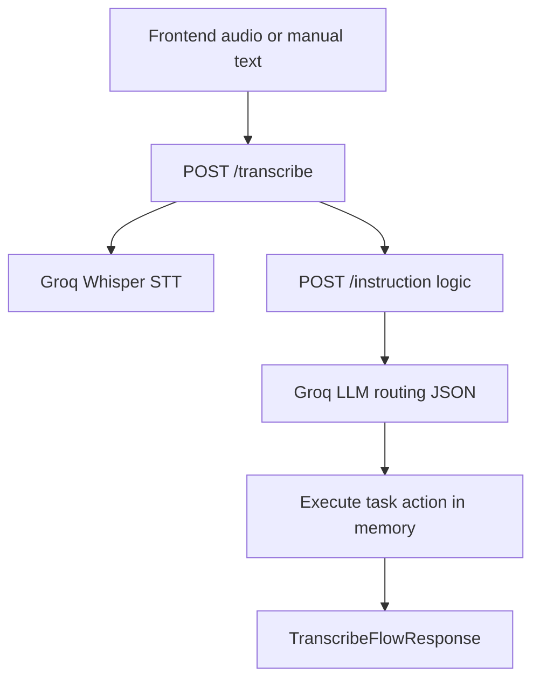

# Backend implementation plan (voice-command-api/src)

## Current state

All business endpoints in [`src/app/api/routes/`](src/app/api/routes/) return **501**. Pydantic models in [`src/app/schemas/voice.py`](src/app/schemas/voice.py) already match the frontend contract. Groq is listed in [`Pipfile`](Pipfile) and configured in [`src/app/core/config.py`](src/app/core/config.py), but no Groq client exists yet.

The frontend only calls **`POST /transcribe`**; it never calls `/instruction` directly. `/instruction` is a backend building block for routing-only debugging and reuse inside `/transcribe`.

## Design decisions (confirmed)

- **Instruction reuse:** `/transcribe` and `POST /instruction` both call the same shared routing service function — no HTTP self-call.
- **LLM task context:** The routing prompt includes the current in-memory task list (`id`, `title`, `done`) so the LLM can correctly route list/update/delete commands to the right `task_id`.



---

## 1. In-memory task store

**New file:** [`src/app/store/tasks.py`](src/app/store/tasks.py)

- Declare module-level `tasks: list[dict]` (or typed list of `Task`-compatible dicts) as the single source of truth.
- Add module-level `_next_id: int = 1` for incremental IDs.
- Expose small functions used by routes and the executor (not HTTP):
  - `list_tasks() -> list[Task]`
  - `create_task(payload: TaskCreate) -> Task`
  - `replace_task(task_id, payload: TaskReplace) -> Task`
  - `patch_task(task_id, payload: TaskUpdate) -> Task`
  - `delete_task(task_id) -> dict[str, str]`
- Raise domain errors (e.g. `TaskNotFoundError`) for missing IDs; routes translate these to **404**.

This satisfies the requirement for a **module-level `tasks` list** while keeping route handlers thin.

---

## 2. Task CRUD endpoints

**Update:** [`src/app/api/routes/tasks.py`](src/app/api/routes/tasks.py)

Replace stubs by delegating to the store module. Keep existing signatures and response models:

| Endpoint | Behavior | Status |
|----------|----------|--------|
| `GET /tasks` | Return all tasks as JSON array | 200 |
| `POST /tasks` | Append task, assign next `id`, return created task | **201** |
| `PUT /tasks/{task_id}` | Full replace (`title`, `done`) | 200 or 404 |
| `PATCH /tasks/{task_id}` | Partial update (only provided fields) | 200 or 404 |
| `DELETE /tasks/{task_id}` | Remove task, return `{"message": "..."}` | 200 or 404 |

No database, no persistence across server restarts (acceptable per constraints).

---

## 3. Groq instruction routing service

**New file:** [`src/app/services/groq_client.py`](src/app/services/groq_client.py)

- Instantiate `Groq(api_key=settings.groq_api_key)` using settings from [`get_settings()`](src/app/core/config.py).
- Add `transcribe_audio(file_bytes, filename, language?)` using `settings.groq_transcription_model` (Whisper).
- Add `route_transcription(transcription: str) -> InstructionPayload` using `settings.groq_model`.

**New file:** [`src/app/services/instruction.py`](src/app/services/instruction.py)

- Build a **system prompt** that:
  - Describes the available task API surface (`GET/POST/PUT/PATCH/DELETE /tasks`, param shapes).
  - **Injects the current task list** from `list_tasks()` on each routing call so the LLM can resolve references like "mark groceries as done" or "delete task 2".
  - Requires **JSON-only** output with exactly: `endpoint`, `method`, `params`.
  - Includes the README example (`"add buy groceries to my list"` → `POST /tasks` with `{ "title": "Buy groceries" }`).
  - Forbids prose, markdown fences, and hardcoded keyword rules in application code.
- Pass the user transcription as the user message.
- Parse LLM output with `json.loads`; validate into `InstructionPayload`.
- On invalid JSON or schema mismatch, return **502** (or **400**) with a clear error — no fallback keyword routing (constraint: **all routing from LLM**).

**Update:** [`src/app/api/routes/instruction.py`](src/app/api/routes/instruction.py)

- Accept `InstructionRequest` (`{ "transcription": "..." }`).
- Call `route_transcription(...)`.
- Return `InstructionPayload` only — **no task execution** on this endpoint.

---

## 4. Instruction executor (task dispatch)

**New file:** [`src/app/services/task_executor.py`](src/app/services/task_executor.py)

Given an `InstructionPayload`, execute the routed action **in-process** by calling the store functions (not HTTP self-calls):

| `method` | `endpoint` | Action |
|----------|------------|--------|
| `GET` | `/tasks` | `list_tasks()` |
| `POST` | `/tasks` | `create_task(TaskCreate(**params))` |
| `PUT` | `/tasks/{id}` | `replace_task(id, TaskReplace(**params))` |
| `PATCH` | `/tasks/{id}` | `patch_task(id, TaskUpdate(**params))` |
| `DELETE` | `/tasks/{id}` | `delete_task(id)` |

- Normalize `method` to uppercase.
- Validate `endpoint` matches `/tasks` patterns only (reject unknown endpoints with **400**).
- Extract `task_id` from path when needed; ensure `params` align with existing Pydantic models.
- Propagate **404** when task ID not found.

This is the bridge between LLM routing JSON and the in-memory task list.

---

## 5. End-to-end `/transcribe` flow

**Update:** [`src/app/api/routes/transcribe.py`](src/app/api/routes/transcribe.py)

Support both frontend input modes:

1. **`multipart/form-data`:** `file` (audio) + optional `language` (use existing [`normalize_transcription_language`](src/app/utils/language.py)) → Groq Whisper → text.
2. **`application/json`:** `{ "transcription": "..." }` → skip STT.

Then orchestrate via the **shared routing service** (same function used by `POST /instruction`):

```
transcription → route_transcription() → execute_instruction() → TranscribeFlowResponse
```

Return:

```json
{
  "transcription": "...",
  "instruction": { "endpoint": "...", "method": "...", "params": {} },
  "result": <task endpoint result>
}
```

This matches what [`frontend/src/main.ts`](frontend/src/main.ts) validates and displays.

---

## 6. Error handling and constraints checklist

- **No database** — only module-level `tasks` list.
- **No intent keyword matching** — no `if "add" in text` anywhere; routing errors surface as HTTP errors, not guessed intents.
- **404** for missing tasks; **400** for malformed executor input; **502** for Groq/LLM parse failures.
- Respect `request_timeout_seconds` from settings on Groq calls where practical.
- Keep CORS and router wiring in [`src/app/main.py`](src/app/main.py) unchanged.

---

## Files to add or change

| File | Action |
|------|--------|
| [`src/app/store/tasks.py`](src/app/store/tasks.py) | **Add** — module-level `tasks`, ID counter, CRUD helpers |
| [`src/app/services/groq_client.py`](src/app/services/groq_client.py) | **Add** — Groq Whisper + chat client |
| [`src/app/services/instruction.py`](src/app/services/instruction.py) | **Add** — system prompt + JSON parsing |
| [`src/app/services/task_executor.py`](src/app/services/task_executor.py) | **Add** — dispatch `InstructionPayload` to store |
| [`src/app/api/routes/tasks.py`](src/app/api/routes/tasks.py) | **Update** — wire CRUD to store |
| [`src/app/api/routes/instruction.py`](src/app/api/routes/instruction.py) | **Update** — Groq routing only |
| [`src/app/api/routes/transcribe.py`](src/app/api/routes/transcribe.py) | **Update** — STT + orchestration |

No schema changes expected — existing models in [`voice.py`](src/app/schemas/voice.py) are sufficient.

---

## Manual verification (after implementation)

1. Start API: `pipenv run uvicorn src.main:app --reload` from project root with `GROQ_API_KEY` in [`.env`](.env).
2. `GET /tasks` → `[]`
3. `POST /instruction` with `{ "transcription": "add buy groceries to my list" }` → routing JSON only.
4. `POST /transcribe` with JSON `{ "transcription": "add buy groceries to my list" }` → full flow with `result` containing new task.
5. Frontend at `localhost:5173`: record or use manual fallback; confirm chat shows transcription + API response.
6. Exercise list/update/delete voice or manual commands to confirm LLM routes all CRUD verbs.
